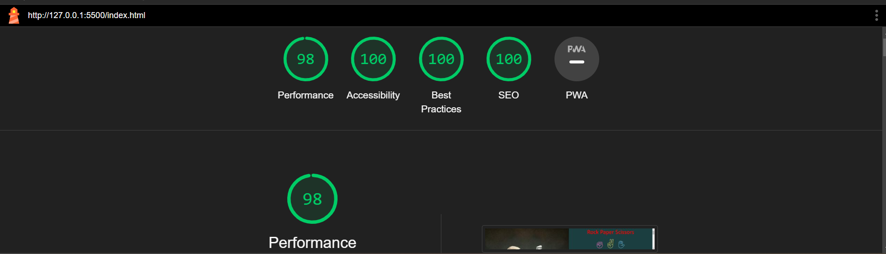

# Rock-Paper-Scissors

## Portfolio Project 2

Rock, Paper, Scissors" is a simple hand game that is often used as a decision-making tool or a quick and fun game between two people. The game is typically played with the hands in a count of three, and each player simultaneously forms one of three shapes with their hand.

The rules of Rock-paper-scissors are:

Scissors cut paper
Paper covers rock
Rock breaks scissors

**[View the live project here.](https://abdulsyed05.github.io/Rock-Paper-Scissors/)**


## Rules of Memory Game

1. Each player forms one of three shapes with an outstretched hand:
   - Rock (a fist)
   - Paper (an open hand)
   - Scissors (a fist with the index and middle fingers extended, forming a V)

2. The players count to three in unison and simultaneously throw one of the three shapes.

3. The winner is determined based on a set of rules:
   - Rock beats Scissors (Rock crushes Scissors)
   - Scissors beats Paper (Scissors cut Paper)
   - Paper beats Rock (Paper covers Rock)

If both players choose the same shape, the game is a tie, and they typically play again. RPS is a game of chance, as there is no skill involved in choosing a shape, making it a popular and fair way to make quick decisions or settle disputes. It's also a common game used in various contexts, including as a simple hand game for children or as a playful way to make choices between adults.


## Project Goals

Develop an interactive and accessible Rock, Paper, Scissors game in JavaScript that provides an engaging gaming experience for users of all ages while promoting skill development, fair play, and user satisfaction

#### First Time Visitor Goals
To introduce first-time visitors to the Rock, Paper, Scissors game in JavaScript and provide a seamless, engaging, and informative experience that encourages them to play, learn the rules, and enjoy the game.

#### Returning Visitor Goals
To provide a memorable and rewarding experience for returning visitors to the Rock, Paper, Scissors game in JavaScript, encouraging them to engage more deeply with the game, explore advanced features, and become regular users.

#### Frequent Visitor Goals
To cultivate a strong and consistent user base for the Rock, Paper, Scissors game in JavaScript by offering regular engagement, opportunities for mastery, and social interaction.

## User Story:
As a casual player of the Rock, Paper, Scissors game, I want the game to be more engaging and intuitive by introducing gesture recognition. The game should be able to recognize and respond to the gestures made by the player. This includes recognizing the gestures for "rock," "paper," and "scissors."

### Design

#### Design Choices
One key design choice for enhancing the user experience in this Rock, Paper, Scissors game in JavaScript is to implement a dynamic AI opponent. This dynamic AI opponent adapts its strategy based on the user's gameplay patterns and skill level.


#### Imagery & Color scheme

The images used on this websites are from gencraft, pngtree, istock,

The main colours used are shades of red, yellow, blue, darkgreen, black and white.


#### Typography
The fonts used for this website are lato and sans-serif.

#### Features
At the home page, there is logo of 2 fist stating it is a Rock-Paper-Scissors game.


The second screen, show the lets play icon.


This is the screen, the user see the choose an option and the fist icon.


This is the screen, the user see the results and fight again icon.


### Wireframes

#### Mobile Home Page Wireframe


#### Tablet Home Page Wireframe


#### Desktop Home Page Wireframe


## Technologies used

### Languages used

* 
* 
* 

The developer used W3C HTML validation and W3C CSS validation to help debug, and check the validity of the website's code.


### Frameworks, Libraries and Programs used

* Bootstrap
* Google fonts 
* Git; used for version control by utilizing the Gitpod terminal to commit to Git, and push to github
* Github; used to store the project code in a repository, and to deploy the page
* Balsamiq; used to create the wireframes during the design process

## Testing

### Validation

* W3C HTML validation
* W3C CSS validation
* JSHint 


### Performance
* Lighthouse from the Google Chrome Developer Tools provided an analysis of the website's performance
 

### Responsiveness
The website is responsive to all devices within the ranges specified below.

* Pixel width : 320 - 400px
* Pixel width : 401 - 550px
* Pixel width : 551 - 800px
* Pixel width : 801 - 900px
* Pixel width : 900px and above


### Bugs Discovered & Resolved
Jshint was showing warning for missing semicolons fixed it. 
No other major warnings, please see screenshot attached above in validation section. 

## Deployment

This project was developed using GitPod, committed to Git and pushed to GitHub using the built-in function within GitPod

### Deploy this project from its GitHub repository

To deploy this project to GitHub Pages from its [GitHub repository](https://abdulsyed05.github.io/Rock-Paper-Scissors/), the following steps were taken:

1. Log into GitHub.
2. From the list of repositories, select **AbdulSyed05/milestoneproject2**
3. From the menu items near the top of the page, select **Settings**.
4. Scroll down to **GitHub Pages** section.
5. Under **Source** click the dropdown menu labelled **None** and select **Master Branch**
6. On selecting Master Branch, the page is automatically refreshed. The website is now deployed.
7. Scroll back down to **GitHub Pages** section to retrieve the link to the deployed website.

### How to run this project locally

To clone this project from GitHub

1. Follow this link to the [Project GitHub repository](https://abdulsyed05.github.io/Rock-Paper-Scissors/)
2. Under the repository name, click "Clone or download".
3. In the Clone with HTTPS section, copy the clone URL for the repository.
4. In your local IDE open Git Bash.
5. Change the current working directory to the location you want the cloned directory to be made.
6. Type ` git clone ` and then press the URL you copied in Step 3
```
$ git clone https://github.com/YOUR-USERNAME/YOUR-REPOSITORY
```
7. Press Enter. Your local clone will be created.

```
$ git clone https://github.com/YOUR-USERNAME/YOUR-REPOSITORY
> Cloning into `CI-Clone`...
> remote: Counting objects: 10, done.
> remote: Compressing objects: 100% (8/8), done.
> remove: Total 10 (delta 1), reused 10 (delta 1)
> Unpacking objects: 100% (10/10), done.
```

#### Acknowledgements

     I owe my mentor Aleksei Konovalov a lot of credit for great mentoring. and the discovery of the cooolor.com for color palettes.
     I owe the Slack community a great deal of credit also for their responsiveness and willingness to always help with small problems!


